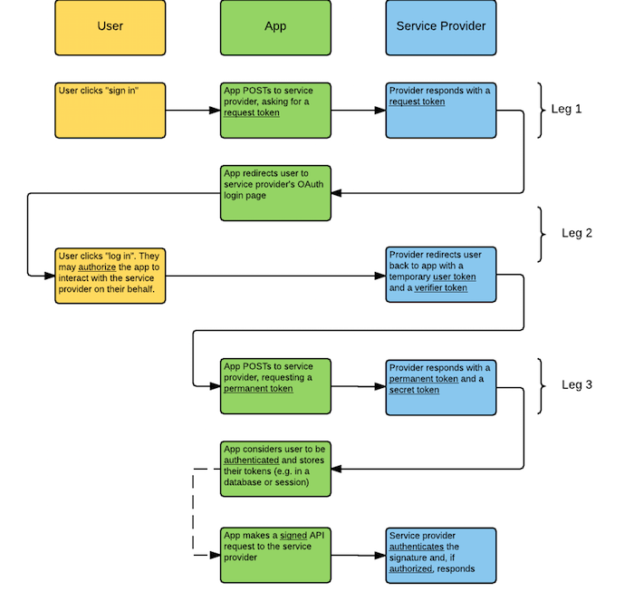

# Handrolled OAuth in Express

## Learning Objectives

- Identify the 3 different "legs" of OAuth
- Use an external API to provide user authentication on an app
- Explain the difference between a session variable and an environment variable

### Big keywords

- Request token
- Consumer key
- Consumer secret
- User token
- User secret
- Callback URL
- Querystring
- Authorize
- Authenticate

## Framing

### What is OAuth?

Most "Log in with X" buttons you see use OAuth. We'll be looking at "Log in with Twitter" today.

**OAuth is a set of standards; not software.** Developers have agreed that this set of standards is a good way to securely **authenticate** users.

In short: your app asks Twitter to log in your user, and if they're successful, Twitter sends your app a special "token" that's unique to that user.

You can stop there and use this as a way of logging people in and out.

You can also take this a step further as a way of letting users **authorize** your app to talk to Twitter's API on their behalf. Using that token, your app can get additional information about the user, make posts for them and so on.

- What's the difference between *authenticating* and *authorizing*?

### The OAuth process

There are several versions and types of OAuth. We'll be using "three-legged" OAuth.

## Registering a Twitter app

Folllow the link below, click "Create New App", and follow the steps.

### Note:

- The **Name**, **Description**, and **Website** are unimportant. Use whatever you want.
- The **Callback URL** should be `http://127.0.0.1:3001/login/twitter/callback`. `127.0.0.1:3001` is an alias for `localhost:3001`. External APIs often don't like to work with `localhost`, but accept `127.0.0.1` just fine.
  - `3001` and `login/twitter/callback` are just what is used in the walkthrough. You could use any port number and path.

### To start:

https://apps.twitter.com/

### Then:

- Click on the "Keys and Access Tokens" tab and copy down the "Consumer Key" and "Consumer Secret"

## Walkthrough

This uses [WhenPresident](https://github.com/ga-wdi-exercises/whenpresident).

### [Go to walkthrough.md](walkthrough.md)

## References

- [Passport](http://passportjs.org/), an NPM package for OAuth with over 300 APIs
  - [Our own Passport lesson plan](https://github.com/ga-wdi-lessons/express-passport)
- [OAuth Bible](http://oauthbible.com/)
- [Request Talking to Twitter](https://github.com/request/request#oauth-signing), from Request's own Github page
- [Coinbase's API](https://developers.coinbase.com/docs/wallet/coinbase-connect/integrating), on which Robin used to work
- Screencasts
