# Added sessions

- What is a session variable? Why is it called a "session" variable?
- What are the two new things being `require`d in this app? How do you install them?
- What does a session "secret" do?
- How does `connect-mongo` relate to sessions?

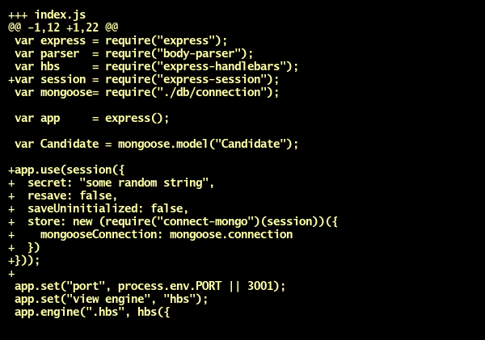

# Removed candidate create form

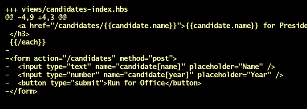

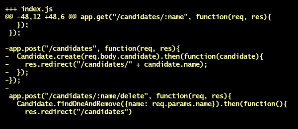

# Added environment variables

- What is an environment variable? Why is it called an "environment" variable?
- Why is it necessary to `gitignore` environment variables?
- What does the `process` variable do?

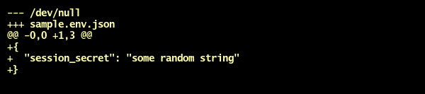

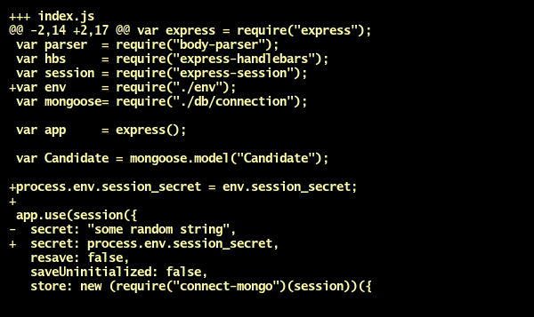

# Added Twitter environment variables

- What's the difference between a "key" and a "secret"?

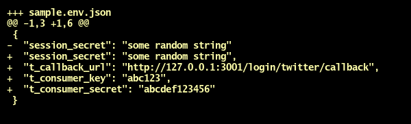

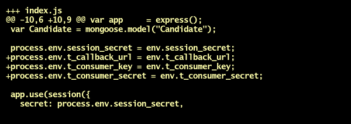

# Redirects to Twitter sign-in page

- What two new modules need to be installed in this step?
- What's a "querystring"?
- What does `qstring.parse` do?
- What are the two arguments in a `request` callback?
- Where does `req.session` "physically" save data?

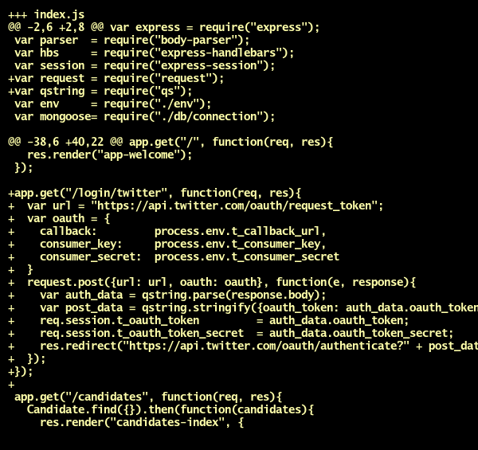

# Completes Twitter authentication process

- What's the relation between `app.get("/login/twitter/callback")` and the `t_callback_url` we've specified?
- What is `req.query`? How is it different from `req.params`?

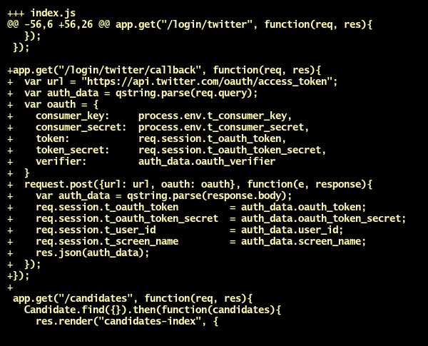

# Fetches user data from API

- Why is all this OAuth information being saved to a single `req.session.t_oauth` object?

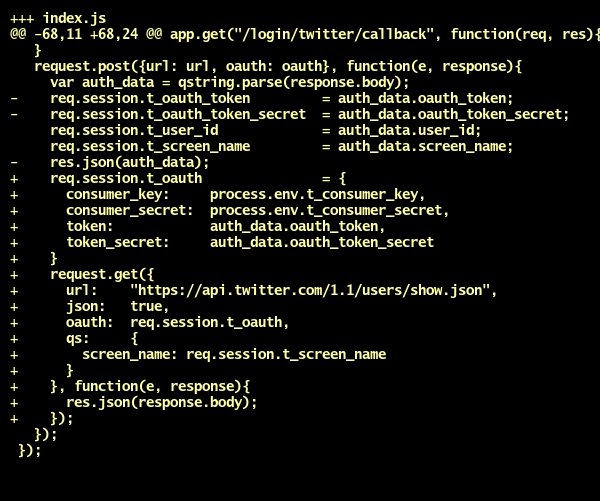

# Saves candidate to database

- Why use `findOneAndUpdate`? Why not just `create`?
- How should you choose which user data to actually save to the database?

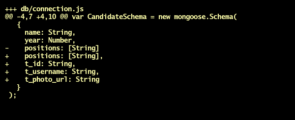
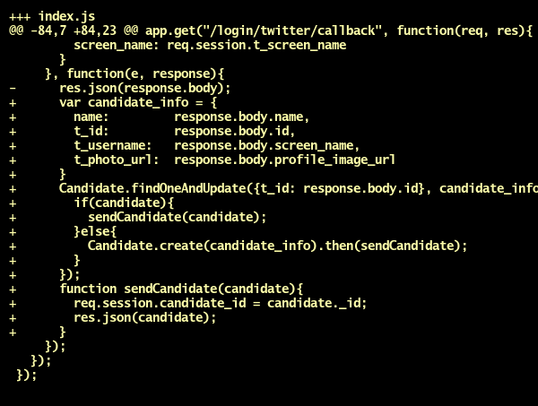

# Displays username and picture

- Why is `app.use` called *middle*ware?
- What's the difference between `res.locals` and `req.session`?
- What's the purpose of the `next` function?

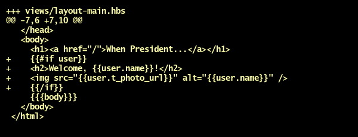
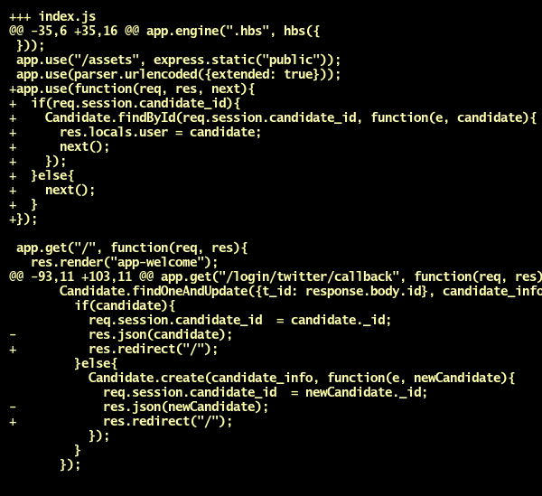

# Added nav bar and signout

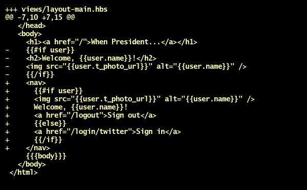
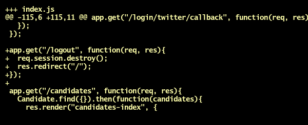

# Added Twitter API test route

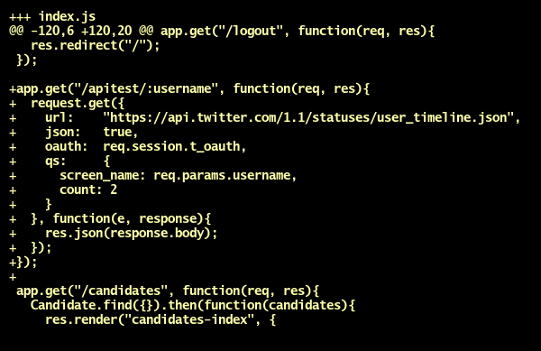

# Moved Twitter stuff to separate file

- What's the advantage of moving the Twitter stuff to a separate file?
- What is the `module.exports` in this file?

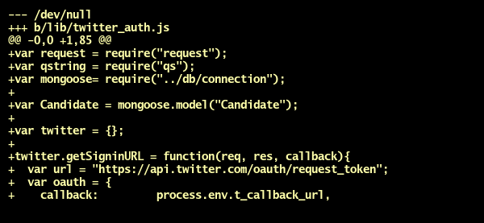

- There's one line not shown in the below image of `index.js`. What is it? (Hint: it's in the first few lines of the file.)

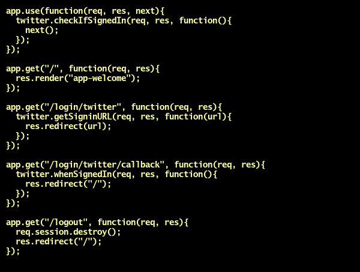

# Can edit/delete only if current user

- Not shown are the changes to `views/candidates-show.hbs`. Nothing needs to be deleted from that file -- some things just need to be inserted (and then re-indented). Can you figure it out? Keep in mind the title of this step!

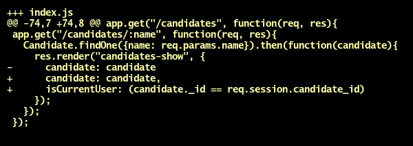

# Only require env.json in development environment

- You don't have your `env.json` on Heroku. How else can you set environment variables on Heroku?

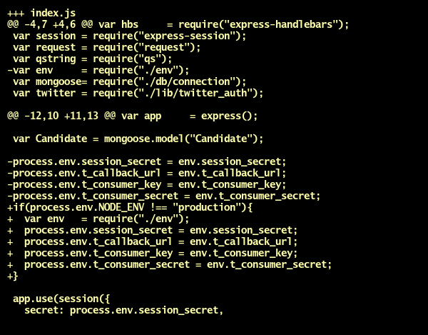
